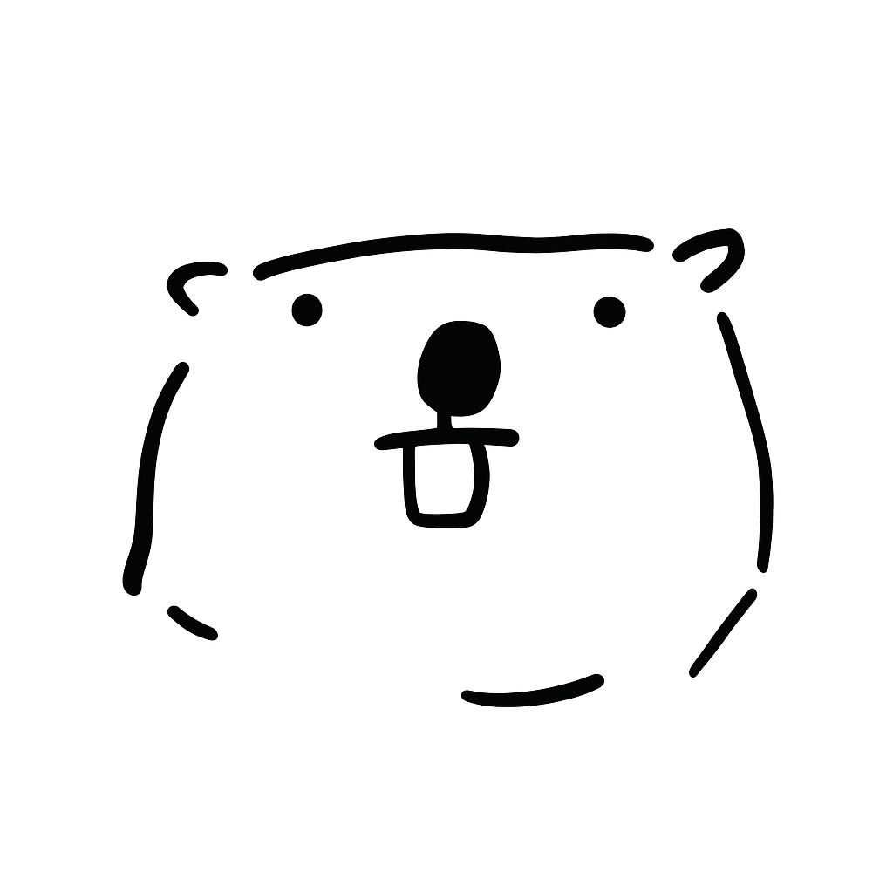

---js
const eleventyNavigation = {
	key: "About",
	order: 3
};
---
# About Me

I’m Angus, a developer who enjoys building things that make life a little simpler and more interesting. This blog is where I share what I’m learning in tech, reflections from day-to-day life, and the occasional post about food or adventures.

When I’m not coding, you’ll probably find me climbing, coaching high school wrestling, or trying a new recipe I probably should’ve followed more closely.