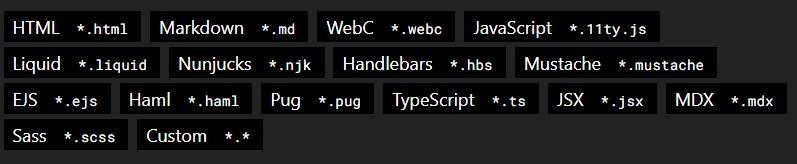

Originally I was planing to create a website for the purpose of showing off some of my devlopement skills. The plan was to use either django, flask, or a combination of FASTAPI and React to create a website that I can use to show off my skills.

I quickly realized that I did not want to pay a cloud service provider to host the website and if possible wanted to host my blog on github pages. Unfortuantly github pages, while great at hosting static sites, is not so great at hosting dynamic web applications.

Even though I no longer was planing to use flask I still enjoyed using their templating engine "Jinga" to quickly create pages. Eventually I settled on using Eleventy, a simple static site generator.

Eleventy provides a wide variety of templating options and is simple enough to use and connect to github actions so that I can use Github Pages to host them. It also uses by default zero javascript.

*templating languages that 11ty supports*

The only problem is that while I now have a pretty good base for a blog, it does not directly show off my stills with some of the more exciting front end frameworks.

With that said this blog is very much a work in progress and im glad I made this as I had a lot of fun working on this blog. Perhaps I can use it to showcase some of my previous and future projects.
