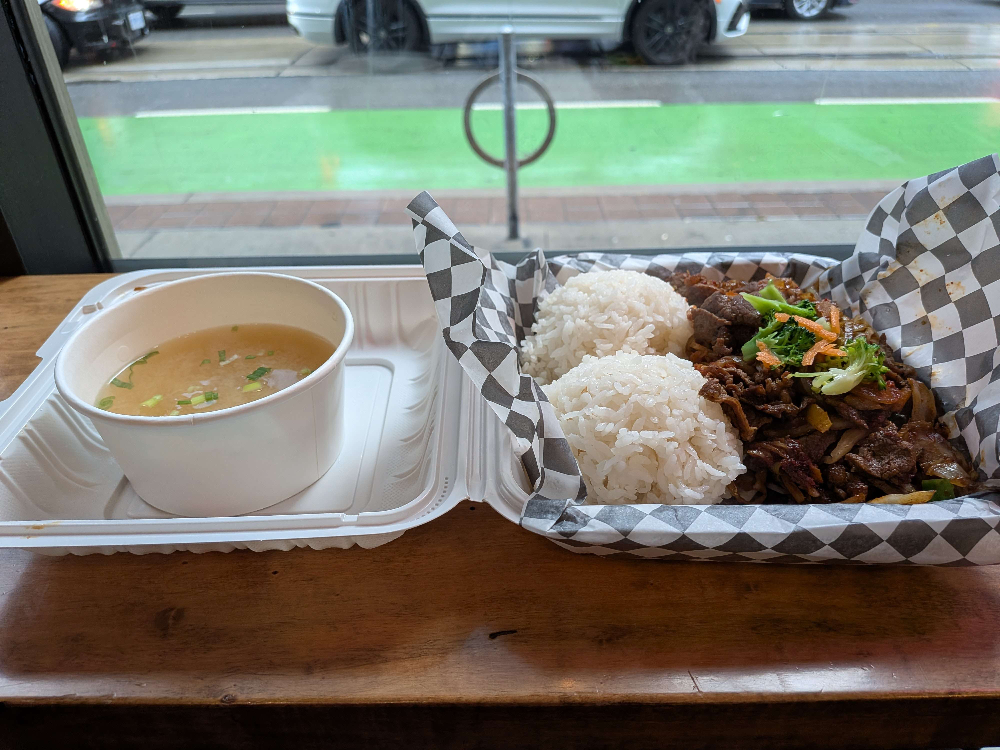

**Location: 105 Victoria St, Toronto, ON M5C 1N7**

I was in the neighborhood helping my friend with an eye appointment and we needed a place to eat. Looking up nearby restaurants around the corner was Bob’s Bulgogi. Since I have not had Korean food in a while and liked that the name sounded like Bob’s Burgers, we decided to check it out.

The inside of the restaurant was very small but cozy, and we were greeted by an older friendly Korean man. I ordered the spicy beef bulgogi with rice and it was pretty good. Altogether the meal was about 20$.

### Rating:
**Price:**
Fair

**Food:**
⭐⭐⭐⭐ 
4 out of 5 Angus’s

**Atmosphere:**
⭐⭐⭐⭐⭐ 
5 out of 5 Angus’s

Final Verdict: Very yummy would go again