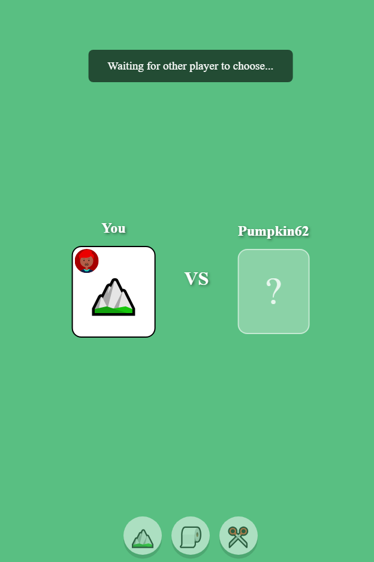

A while back, I had the pleasure of doing a game jam with some friends. We made a multiplayer platformer called [Cat Run](https://arkaniii.itch.io/cat-run), where you race with some friends. This introduced me to [PlayroomKit](https://joinplayroom.com/) , a development tool used to create real-time web-based multiplayer games.

Anyway, I had some free time this evening and wanted to work on a React project.  I remembered that Playroomkit could be easily integrated with React applications. So I decided to create a small little rock-paper-scissors game. The game was quickly thrown together, taking inspiration from [Rock Paper Scissors Online](https://www.rpsgame.org/), but I am impressed in what I was able to do in such a short time.

In comparison, I once created a similar game using lua and the game looked horrible. Also it took me so much time to set up the multiplayer component of of my lua game.

To play, one player creates a lobby and sends a link to their friend. Once the friend joins the host can start the game.

To create a lobby:
https://angusryoung.github.io/react-game/

To look at the code:
https://github.com/angusryoung/react-game
